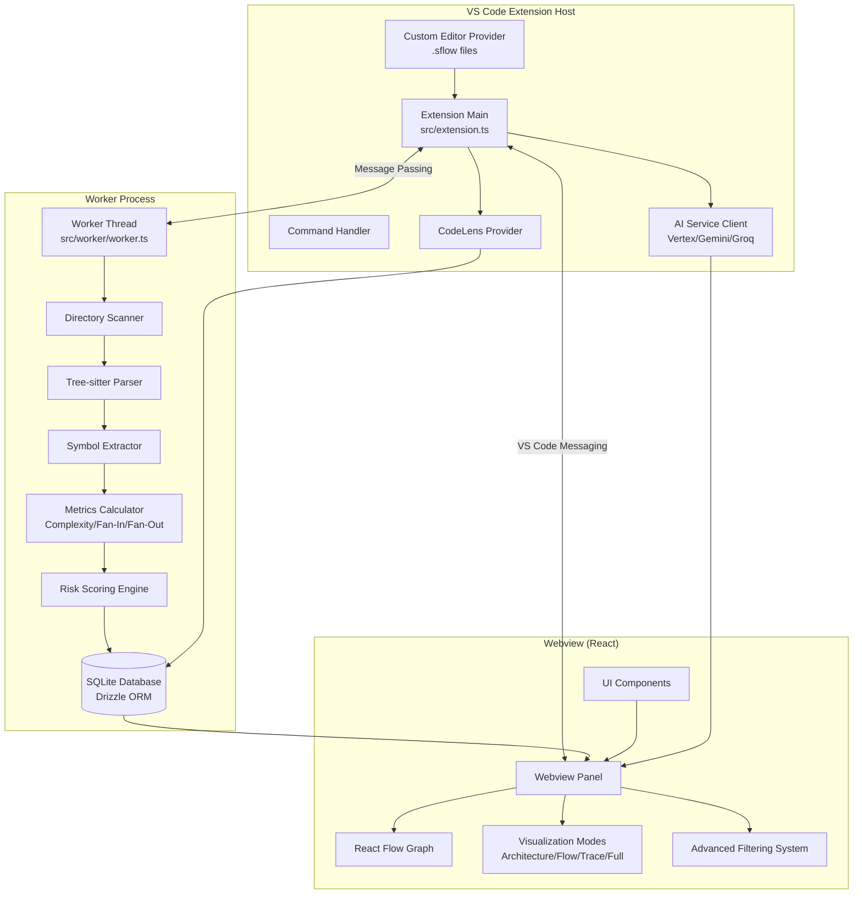

# Design Document: SentinelFlow

## Overview

SentinelFlow is a VS Code extension that provides system flow visualization and architectural insight. The extension is an advisor-only tool that explains architectural risk without modifying code. Phase 1 implements the System Flow Extractor with four main components:

1. **Extension Host** (Main Process): Orchestrates operations, manages UI integration, handles VS Code API interactions, provides CodeLens, and manages AI service integration
2. **Worker Process** (Background Thread): Performs scanning, parsing, symbol extraction, relationship detection, metric calculation, and database operations without blocking the Extension Host
3. **System Flow Extractor**: Scans directories, parses files with Tree-sitter, extracts symbols and relationships, calculates metrics, and builds graph models
4. **Webview** (Renderer Process): Provides interactive React-based visualization using React Flow with multiple visualization modes

The extension uses Tree-sitter for language-agnostic parsing, SQLite for persistent storage, and integrates with AI services (Vertex AI, Gemini, Groq) for intelligent code analysis. All AI features are user-triggered, maintaining the zero-noise philosophy.

## Architecture

### High-Level Component Diagram



### Process Communication

The extension uses message-passing for inter-process communication:

- **Extension Host ↔ Worker Process**: Node.js Worker Threads with structured message protocol
- **Extension Host ↔ Webview**: VS Code Webview API with postMessage
- **Extension Host ↔ AI Services**: HTTP/REST API calls with retry logic

### Data Flow

1. **Scanning Flow**: File System → Worker Process (Directory Scanner) → Tree-sitter Parser → Symbol Extractor → Metrics Calculator → Risk Scoring Engine → SQLite Database
2. **Visualization Flow**: Extension Host (request) → Worker Process (query DB) → Webview (render with mode-specific filtering)
3. **Navigation Flow**: Webview (node click) → Extension Host → VS Code Editor API
4. **CodeLens Flow**: Extension Host (file open) → Worker Process (query DB) → CodeLens Provider (display)
5. **AI Analysis Flow**: Extension Host (user request) → AI Service → Extension Host (process) → Webview (display)

## Components and Interfaces

### 1. Extension Host (src/extension.ts)

**Responsibilities:**
- Extension lifecycle management (activate/deactivate)
- Command registration and handling
- CodeLens provider registration and management
- Custom editor provider registration for .sflow files
- Webview panel management
- Configuration management
- Worker process spawning and supervision
- Coordination with System Flow Extractor

**Key Interfaces:**

```typescript
interface ExtensionContext {
  subscriptions: Disposable[];
  workspaceState: Memento;
  globalState: Memento;
  extensionPath: string;
}

interface WorkerMessage {
  type: 'scan' | 'query' | 'getMetrics' | 'status';
  payload: any;
  requestId: string;
}

interface WorkerResponse {
  type: 'success' | 'error' | 'progress';
  payload: any;
  requestId: string;
}

interface WebviewMessage {
  type: 'requestGraph' | 'selectNode' | 'openFile' | 'applyFilter' | 'changeMode';
  payload: any;
}

interface WebviewResponse {
  type: 'graphData' | 'nodeDetails' | 'error';
  payload: any;
}
```

**Commands:**
- `sentinelflow.openGraph`: Open visualization webview
- `sentinelflow.traceSymbol`: Open Trace Mode for selected symbol
- `sentinelflow.analyzeRisks`: Run risk analysis on workspace
- `sentinelflow.analyzeBlastRadius`: Calculate blast radius for selected symbol
- `sentinelflow.explainCode`: Request AI explanation for selection
- `sentinelflow.detectTechnicalDebt`: Run technical debt analysis
- `sentinelflow.suggestRefactoring`: Get AI refactoring suggestions
- `sentinelflow.analyzePerformance`: Get AI performance optimization suggestions
- `sentinelflow.rescan`: Re-scan workspace and rebuild graph
- `sentinelflow.rebuildIndex`: Clear and rebuild entire index
- `sentinelflow.configureApiKeys`: Open API key configuration
- `sentinelflow.exportDiagnostics`: Export diagnostic logs

### 2. Worker Process (src/worker/worker.ts)

**Responsibilities:**
- File system scanning and monitoring
- Tree-sitter parsing orchestration
- Symbol extraction and relationship mapping
- Cyclomatic complexity calculation
- Fan-In and Fan-Out calculation
- In-memory graph construction and maintenance
- Message handling from Extension Host

**Key Interfaces:**

```typescript
interface WorkerRequest {
  type: 'scan' | 'query' | 'getMetrics';
  payload: any;
  requestId: string;
}

interface ScanRequest {
  workspacePath: string;
  filePatterns: string[];
  excludePatterns: string[];
}

interface MetricsQuery {
  symbolId?: string;
  filePath?: string;
}
```

**Database Schema (Drizzle ORM):**

```typescript
// Domains table
const domains = sqliteTable('domains', {
  id: text('id').primaryKey(),
  name: text('name').notNull(),
  path: text('path').notNull(),
  createdAt: integer('created_at').notNull(),
});

// Files table
const files = sqliteTable('files', {
  id: text('id').primaryKey(),
  path: text('path').notNull().unique(),
  domainId: text('domain_id').references(() => domains.id),
  hash: text('hash').notNull(),
  lastIndexed: integer('last_indexed').notNull(),
});

// Symbols table
const symbols = sqliteTable('symbols', {
  id: text('id').primaryKey(),
  name: text('name').notNull(),
  type: text('type').notNull(),
  fileId: text('file_id').references(() => files.id),
  startLine: integer('start_line').notNull(),
  endLine: integer('end_line').notNull(),
  complexity: integer('complexity'),
  fanIn: integer('fan_in').default(0),
  fanOut: integer('fan_out').default(0),
  riskScore: real('risk_score'),
});

// Relationships table
const relationships = sqliteTable('relationships', {
  id: text('id').primaryKey(),
  fromSymbolId: text('from_symbol_id').references(() => symbols.id),
  toSymbolId: text('to_symbol_id').references(() => symbols.id),
  type: text('type').notNull(),
  weight: integer('weight').default(1),
});

// Technical debt table
const technicalDebt = sqliteTable('technical_debt', {
  id: text('id').primaryKey(),
  symbolId: text('symbol_id').references(() => symbols.id),
  type: text('type').notNull(),
  severity: text('severity').notNull(),
  description: text('description').notNull(),
  remediation: text('remediation'),
  detectedAt: integer('detected_at').notNull(),
});
```

### 3. System Flow Extractor

**Responsibilities:**
- File system scanning
- Tree-sitter parsing orchestration
- Symbol extraction and relationship mapping
- In-memory graph construction
- Cyclomatic complexity calculation
- Fan-In and Fan-Out calculation

**Key Interfaces:**

```typescript
interface ParsedSymbol {
  id: string;
  name: string;
  type: 'function' | 'class' | 'variable' | 'interface' | 'type';
  filePath: string;
  startLine: number;
  endLine: number;
  complexity?: number;
}

interface SymbolRelationship {
  fromSymbolId: string;
  toSymbolId: string;
  type: 'calls' | 'imports' | 'references';
}

interface GraphModel {
  symbols: Map<string, ParsedSymbol>;
  relationships: SymbolRelationship[];
  fanIn: Map<string, number>;
  fanOut: Map<string, number>;
}
```

**Algorithm: Directory Scanning**

```
function scanWorkspace(workspacePath: string, excludePatterns: string[]): string[]:
  files = []
  
  function scanDirectory(dirPath: string):
    entries = readDirectory(dirPath)
    
    for each entry in entries:
      if entry.isDirectory():
        if not matchesExcludePattern(entry.path, excludePatterns):
          scanDirectory(entry.path)
      else if entry.isFile():
        if isSupportedFileType(entry.path):
          files.push(entry.path)
  
  scanDirectory(workspacePath)
  return files
```

**Algorithm: Symbol Extraction**

```
function extractSymbols(filePath: string): ParsedSymbol[]:
  sourceCode = readFile(filePath)
  ast = treeSitter.parse(sourceCode)
  symbols = []
  
  function traverse(node: ASTNode):
    if node.type in ['function_declaration', 'class_declaration', 'variable_declaration']:
      complexity = null
      if node.type == 'function_declaration':
        complexity = calculateComplexity(node)
      
      symbol = {
        id: generateId(filePath, node.name),
        name: node.name,
        type: mapNodeTypeToSymbolType(node.type),
        filePath: filePath,
        startLine: node.startPosition.row,
        endLine: node.endPosition.row,
        complexity: complexity
      }
      symbols.push(symbol)
    
    for each child in node.children:
      traverse(child)
  
  traverse(ast.rootNode)
  return symbols
```

**Algorithm: Cyclomatic Complexity Calculation**

```
function calculateComplexity(node: ASTNode): number:
  complexity = 1  // Base complexity
  
  function traverse(n: ASTNode):
    if n.type in ['if_statement', 'while_statement', 'for_statement', 
                   'case_statement', 'catch_clause', 'conditional_expression',
                   'logical_and', 'logical_or']:
      complexity += 1
    
    for each child in n.children:
      traverse(child)
  
  traverse(node)
  return complexity
```

**Algorithm: Relationship Detection**

```
function extractRelationships(filePath: string, ast: ASTNode, symbols: ParsedSymbol[]): SymbolRelationship[]:
  relationships = []
  
  function traverse(node: ASTNode, currentSymbol: ParsedSymbol):
    if node.type == 'call_expression':
      calledSymbol = resolveSymbol(node.functionName, symbols)
      if calledSymbol:
        relationships.push({
          fromSymbolId: currentSymbol.id,
          toSymbolId: calledSymbol.id,
          type: 'calls'
        })
    
    if node.type == 'import_statement':
      importedFile = resolveImport(node.importPath, filePath)
      relationships.push({
        fromSymbolId: currentSymbol.id,
        toSymbolId: importedFile,
        type: 'imports'
      })
    
    for each child in node.children:
      traverse(child, currentSymbol)
  
  for each symbol in symbols:
    symbolNode = findNodeForSymbol(ast, symbol)
    traverse(symbolNode, symbol)
  
  return relationships
```

**Algorithm: Fan-In and Fan-Out Calculation**

```
function calculateMetrics(graph: GraphModel):
  fanIn = new Map()
  fanOut = new Map()
  
  // Initialize all symbols with 0
  for each symbol in graph.symbols:
    fanIn.set(symbol.id, 0)
    fanOut.set(symbol.id, 0)
  
  // Count relationships
  for each relationship in graph.relationships:
    fanOut.set(relationship.fromSymbolId, fanOut.get(relationship.fromSymbolId) + 1)
    fanIn.set(relationship.toSymbolId, fanIn.get(relationship.toSymbolId) + 1)
  
  graph.fanIn = fanIn
  graph.fanOut = fanOut
```

### 4. CodeLens Provider

**Responsibilities:**
- Provide inline code metrics in editor
- Display complexity indicators
- Display Fan-In and Fan-Out metrics
- Offer Trace action entry point
- Apply visual warning thresholds
- Remain strictly read-only

**Key Interfaces:**

```typescript
interface CodeLensData {
  symbolId: string;
  complexity?: number;
  fanIn: number;
  fanOut: number;
  range: Range;
}

interface WarningThreshold {
  complexity: number;  // > 15 = warning
  fanIn: number;       // > 20 = critical
  fanOut: number;      // > 15 = elevated
}
```

**Implementation:**

```typescript
class SentinelFlowCodeLensProvider implements CodeLensProvider {
  async provideCodeLenses(document: TextDocument): Promise<CodeLens[]> {
    const symbols = await worker.getSymbolsForFile(document.uri.fsPath);
    const lenses: CodeLens[] = [];
    
    for (const symbol of symbols) {
      const range = new Range(symbol.startLine, 0, symbol.startLine, 0);
      const fanIn = await worker.getFanIn(symbol.id);
      const fanOut = await worker.getFanOut(symbol.id);
      
      // Determine styling based on thresholds
      const isComplexityWarning = symbol.complexity && symbol.complexity > 15;
      const isFanInCritical = fanIn > 20;
      const isFanOutElevated = fanOut > 15;
      
      // Complexity indicator
      if (symbol.complexity) {
        const complexityLens = new CodeLens(range, {
          title: `Complexity: ${symbol.complexity}${isComplexityWarning ? ' ⚠️' : ''}`,
          command: '',
        });
        lenses.push(complexityLens);
      }
      
      // Coupling indicator
      const couplingLens = new CodeLens(range, {
        title: `Fan-In: ${fanIn}${isFanInCritical ? ' 🔴' : ''} | Fan-Out: ${fanOut}${isFanOutElevated ? ' 🟡' : ''}`,
        command: '',
      });
      lenses.push(couplingLens);
      
      // Trace action
      const traceLens = new CodeLens(range, {
        title: '$(debug-start) Trace',
        command: 'sentinelflow.traceSymbol',
        arguments: [symbol.id],
      });
      lenses.push(traceLens);
    }
    
    return lenses;
  }
}
```

**Correctness Property:**

For any symbol displayed with CodeLens, the complexity and coupling values shown must exactly match the values computed by the System Flow Extractor.

### 5. Visualization Pipeline

**Responsibilities:**
- Transform graph data for React Flow
- Handle user interactions (zoom, pan, selection)
- Implement semantic zoom via hierarchical aggregation
- Apply coupling heat indicators
- Render visualization modes (Architecture, Flow, Trace, Full)
- Apply advanced filtering system

**Key Interfaces:**

```typescript
interface GraphNode {
  id: string;
  type: 'file' | 'symbol';
  data: {
    label: string;
    complexity?: number;
    fanIn?: number;
    fanOut?: number;
    couplingHeat?: number;
  };
  position: { x: number; y: number };
}

interface GraphEdge {
  id: string;
  source: string;
  target: string;
  type: 'calls' | 'imports' | 'references' | 'aggregated';
  animated?: boolean;
}

interface VisualizationMode {
  type: 'architecture' | 'flow' | 'trace' | 'full';
  focusSymbolId?: string;
  maxDepth?: number;
}

interface FilterState {
  riskLevel?: 'low' | 'medium' | 'high';
  nodeType?: 'file' | 'symbol';
  directoryScope?: string;
  nameSearch?: string;
}

interface ZoomLevel {
  level: number; // 0 = file-level, 1 = symbol-level
  aggregated: boolean;
}
```

**Algorithm: Graph Transformation for React Flow**

```
function transformToReactFlow(graph: GraphModel): { nodes: GraphNode[], edges: GraphEdge[] }:
  nodes = []
  edges = []
  
  // Create nodes for each symbol
  for each symbol in graph.symbols.values():
    couplingHeat = calculateCouplingHeat(
      graph.fanIn.get(symbol.id),
      graph.fanOut.get(symbol.id)
    )
    
    nodes.push({
      id: symbol.id,
      type: 'symbol',
      data: {
        label: symbol.name,
        fanIn: graph.fanIn.get(symbol.id),
        fanOut: graph.fanOut.get(symbol.id),
        couplingHeat: couplingHeat
      },
      position: { x: 0, y: 0 } // Layout will be computed by React Flow
    })
  
  // Create edges for each relationship
  for each relationship in graph.relationships:
    edges.push({
      id: `${relationship.fromSymbolId}-${relationship.toSymbolId}`,
      source: relationship.fromSymbolId,
      target: relationship.toSymbolId,
      type: relationship.type
    })
  
  return { nodes, edges }
```

**Algorithm: Coupling Heat Calculation**

```
function calculateCouplingHeat(fanIn: number, fanOut: number): number:
  totalCoupling = fanIn + fanOut
  
  // Normalize to 0-100 scale
  // Thresholds: 0-5 = low, 6-15 = medium, 16+ = high
  if totalCoupling <= 5:
    return totalCoupling * 10  // 0-50
  else if totalCoupling <= 15:
    return 50 + (totalCoupling - 5) * 3  // 50-80
  else:
    return min(100, 80 + (totalCoupling - 15) * 2)  // 80-100
```

**Algorithm: Risk Level Calculation**

```
function calculateRiskLevel(symbol: ParsedSymbol, fanIn: number, fanOut: number): 'low' | 'medium' | 'high':
  // High risk: complexity > 15 OR fanIn > 20 OR fanOut > 15
  if (symbol.complexity && symbol.complexity > 15) or fanIn > 20 or fanOut > 15:
    return 'high'
  
  // Medium risk: complexity > 10 OR fanIn > 10 OR fanOut > 10
  if (symbol.complexity && symbol.complexity > 10) or fanIn > 10 or fanOut > 10:
    return 'medium'
  
  return 'low'
```

**Algorithm: Visualization Mode Rendering**

```
function renderVisualizationMode(graph: GraphModel, mode: VisualizationMode): { nodes: GraphNode[], edges: GraphEdge[] }:
  switch mode.type:
    case 'architecture':
      return renderArchitectureMode(graph)
    
    case 'flow':
      return renderFlowMode(graph, mode.focusSymbolId, mode.maxDepth)
    
    case 'trace':
      return renderTraceMode(graph, mode.focusSymbolId)
    
    case 'full':
      return transformToReactFlow(graph)

function renderArchitectureMode(graph: GraphModel): { nodes: GraphNode[], edges: GraphEdge[] }:
  // Display file-level nodes only with aggregated relationships
  return aggregateToFileLevel(graph)

function renderFlowMode(graph: GraphModel, symbolId: string, maxDepth: number): { nodes: GraphNode[], edges: GraphEdge[] }:
  // Display execution path from selected symbol
  visited = new Set()
  nodes = []
  edges = []
  
  function traverse(currentId: string, depth: number):
    if depth > maxDepth or currentId in visited:
      return
    
    visited.add(currentId)
    symbol = graph.symbols.get(currentId)
    nodes.push(createNode(symbol))
    
    // Get outgoing calls only (directional)
    outgoing = graph.relationships.filter(r => r.fromSymbolId == currentId and r.type == 'calls')
    for each rel in outgoing:
      edges.push(createEdge(rel))
      traverse(rel.toSymbolId, depth + 1)
  
  traverse(symbolId, 0)
  return { nodes, edges }

function renderTraceMode(graph: GraphModel, symbolId: string): { nodes: GraphNode[], edges: GraphEdge[] }:
  // Display both incoming and outgoing relationships
  nodes = []
  edges = []
  visited = new Set()
  
  // Add focus symbol
  focusSymbol = graph.symbols.get(symbolId)
  nodes.push(createNode(focusSymbol))
  visited.add(symbolId)
  
  // Add all incoming relationships (Fan-In)
  incoming = graph.relationships.filter(r => r.toSymbolId == symbolId)
  for each rel in incoming:
    if not visited.has(rel.fromSymbolId):
      symbol = graph.symbols.get(rel.fromSymbolId)
      nodes.push(createNode(symbol))
      visited.add(rel.fromSymbolId)
    edges.push(createEdge(rel))
  
  // Add all outgoing relationships (Fan-Out)
  outgoing = graph.relationships.filter(r => r.fromSymbolId == symbolId)
  for each rel in outgoing:
    if not visited.has(rel.toSymbolId):
      symbol = graph.symbols.get(rel.toSymbolId)
      nodes.push(createNode(symbol))
      visited.add(rel.toSymbolId)
    edges.push(createEdge(rel))
  
  return { nodes, edges }
```

**Algorithm: Advanced Filtering**

```
function applyFilters(nodes: GraphNode[], filters: FilterState): GraphNode[]:
  filteredNodes = nodes
  
  // Apply risk level filter
  if filters.riskLevel:
    filteredNodes = filteredNodes.filter(node => {
      riskLevel = calculateRiskLevel(node.data.complexity, node.data.fanIn, node.data.fanOut)
      return riskLevel == filters.riskLevel
    })
  
  // Apply node type filter
  if filters.nodeType:
    filteredNodes = filteredNodes.filter(node => node.type == filters.nodeType)
  
  // Apply directory scope filter
  if filters.directoryScope:
    filteredNodes = filteredNodes.filter(node => {
      symbol = getSymbolById(node.id)
      return symbol.filePath.startsWith(filters.directoryScope)
    })
  
  // Apply name search filter
  if filters.nameSearch:
    filteredNodes = filteredNodes.filter(node => 
      node.data.label.toLowerCase().includes(filters.nameSearch.toLowerCase())
    )
  
  return filteredNodes

function getVisibleNodeCount(filteredNodes: GraphNode[], totalNodes: GraphNode[]): string:
  return `Showing ${filteredNodes.length} of ${totalNodes.length} nodes`
```

**Correctness Properties:**

1. For any selected visualization mode, only nodes and relationships relevant to that mode must be rendered, and all unrelated elements must be hidden.
2. A node must be visible if and only if it satisfies all active filters simultaneously (logical AND).
3. The displayed visible-node count must exactly match the number of rendered nodes.

**Algorithm: Semantic Zoom via Hierarchical Aggregation**

```
function applySemanticZoom(graph: GraphModel, zoomLevel: number): { nodes: GraphNode[], edges: GraphEdge[] }:
  if zoomLevel >= 1:
    // Symbol-level view (fully expanded)
    return transformToReactFlow(graph)
  else:
    // File-level view (aggregated)
    return aggregateToFileLevel(graph)

function aggregateToFileLevel(graph: GraphModel): { nodes: GraphNode[], edges: GraphEdge[] }:
  fileNodes = new Map()
  fileEdges = new Map()
  
  // Group symbols by file
  for each symbol in graph.symbols.values():
    if not fileNodes.has(symbol.filePath):
      fileNodes.set(symbol.filePath, {
        id: symbol.filePath,
        type: 'file',
        data: {
          label: getFileName(symbol.filePath),
          fanIn: 0,
          fanOut: 0
        },
        position: { x: 0, y: 0 }
      })
    
    // Aggregate metrics
    fileNode = fileNodes.get(symbol.filePath)
    fileNode.data.fanIn += graph.fanIn.get(symbol.id)
    fileNode.data.fanOut += graph.fanOut.get(symbol.id)
  
  // Aggregate relationships to file-level
  for each relationship in graph.relationships:
    fromFile = graph.symbols.get(relationship.fromSymbolId).filePath
    toFile = graph.symbols.get(relationship.toSymbolId).filePath
    
    if fromFile != toFile:
      edgeKey = `${fromFile}-${toFile}`
      if not fileEdges.has(edgeKey):
        fileEdges.set(edgeKey, {
          id: edgeKey,
          source: fromFile,
          target: toFile,
          type: 'aggregated'
        })
  
  return {
    nodes: Array.from(fileNodes.values()),
    edges: Array.from(fileEdges.values())
  }
```

### 6. Custom Editor Provider for .sflow Files

**Responsibilities:**
- Register custom editor for .sflow file extension
- Serialize and deserialize graph state
- Provide save and load functionality

**Implementation:**

```typescript
class SFlowEditorProvider implements CustomTextEditorProvider {
  async resolveCustomTextEditor(
    document: TextDocument,
    webviewPanel: WebviewPanel
  ): Promise<void> {
    // Load graph state from .sflow file
    const graphState = JSON.parse(document.getText());
    
    // Send graph state to webview
    webviewPanel.webview.postMessage({
      type: 'loadGraph',
      payload: graphState
    });
    
    // Handle save requests from webview
    webviewPanel.webview.onDidReceiveMessage(message => {
      if (message.type === 'saveGraph') {
        const edit = new WorkspaceEdit();
        edit.replace(
          document.uri,
          new Range(0, 0, document.lineCount, 0),
          JSON.stringify(message.payload, null, 2)
        );
        workspace.applyEdit(edit);
      }
    });
  }
}
```

### 7. AI Integration Layer

**Responsibilities:**
- Manage API client instances for Vertex AI, Gemini, and Groq
- Route requests to appropriate AI service
- Handle rate limiting and retries
- Format prompts and parse responses
- Cache AI responses
- Maintain zero-noise philosophy (all features user-triggered)

**Key Interfaces:**

```typescript
interface AIService {
  explain(code: string, context: string): Promise<string>;
  detectTechnicalDebt(code: string): Promise<TechnicalDebtItem[]>;
  suggestRefactoring(code: string, context: string): Promise<RefactoringSuggestion[]>;
  analyzePerformance(code: string, context: string): Promise<PerformanceInsight[]>;
  assessFragility(code: string, metrics: SymbolMetrics): Promise<number>;
  identifyArchitecturalPatterns(domains: Domain[]): Promise<ArchitecturalPattern[]>;
}

interface TechnicalDebtItem {
  type: string;
  severity: 'critical' | 'high' | 'medium' | 'low';
  description: string;
  location: { line: number; column: number };
  remediation: string;
}

interface RefactoringSuggestion {
  title: string;
  description: string;
  benefits: string[];
  risks: string[];
  diff: string;
  estimatedEffort: 'low' | 'medium' | 'high';
}

interface PerformanceInsight {
  type: 'algorithmic' | 'memory' | 'io';
  description: string;
  impact: 'high' | 'medium' | 'low';
  suggestion: string;
  estimatedImprovement: string;
}
```

**AI Service Selection Strategy:**

```
function selectAIService(taskType: string): AIService:
  if taskType == 'explain' or taskType == 'refactor':
    // Use Gemini for conversational tasks (if available)
    if geminiApiKey:
      return geminiService
    else:
      return vertexService
  
  else if taskType == 'debt' or taskType == 'performance':
    // Use Groq for fast analysis (if available)
    if groqApiKey:
      return groqService
    else:
      return vertexService
  
  else:
    // Default to Vertex AI
    return vertexService
```

### 8. Risk Scoring Engine

**Responsibilities:**
- Calculate risk scores for symbols
- Identify high-risk code patterns
- Compute blast radius
- Aggregate risk metrics
- Store risk data in database

**Algorithm: Risk Score Calculation**

```
function calculateRiskScore(symbol: ParsedSymbol, fanIn: number, fanOut: number, aiFragility: number): number:
  score = 0
  
  // Complexity factor (0-40 points)
  if symbol.complexity and symbol.complexity > 15:
    score += min(40, symbol.complexity * 2)
  
  // Coupling factor (0-30 points)
  if fanIn > 20:
    score += min(30, fanIn)
  
  // AI fragility assessment (0-30 points)
  if aiFragility:
    score += aiFragility
  
  // Normalize to 0-100
  return min(100, score)
```

**Algorithm: Blast Radius Calculation**

```
function calculateBlastRadius(symbolId: string, db: Database): BlastRadiusResult:
  affected = new Set()
  distances = new Map()
  queue = [(symbolId, 0)]
  
  while queue is not empty:
    (currentId, distance) = queue.dequeue()
    
    if currentId in affected:
      continue
    
    affected.add(currentId)
    distances.set(currentId, distance)
    
    // Get all symbols that depend on current symbol
    dependents = db.query(`
      SELECT fromSymbolId FROM relationships 
      WHERE toSymbolId = ? AND type IN ('calls', 'imports', 'references')
    `, [currentId])
    
    for each dep in dependents:
      if dep.fromSymbolId not in affected:
        queue.enqueue((dep.fromSymbolId, distance + 1))
  
  return {
    affectedSymbols: affected,
    distances: distances,
    totalImpact: affected.size
  }
```

### 9. Domain-Level Modeling

**Responsibilities:**
- Group files into architectural domains
- Aggregate domain-level relationships
- Support Architecture Mode visualization
- Enable AI pattern detection

**Algorithm: Domain Extraction**

```
function extractDomains(files: File[]): Domain[]:
  domains = new Map()
  
  for each file in files:
    // Extract domain from directory structure
    // e.g., "src/auth/login.ts" → domain "auth"
    pathParts = file.path.split('/')
    domainName = pathParts[1] // Assuming src/domain/file structure
    
    if not domains.has(domainName):
      domains.set(domainName, {
        id: generateId(domainName),
        name: domainName,
        path: pathParts.slice(0, 2).join('/'),
        files: []
      })
    
    domains.get(domainName).files.push(file)
  
  return Array.from(domains.values())
```

## Data Models

### Core Entities

**Domain:**
- Represents a high-level architectural component or module
- Aggregates related files
- Used in Architecture Mode visualization
- Stored in SQLite database

**File:**
- Represents a source code file
- Contains multiple symbols
- Tracks hash for incremental indexing
- Linked to domain
- Stored in SQLite database

**Symbol:**
- Represents a code entity (function, class, variable, etc.)
- Contains location information (file path, line numbers)
- Contains cyclomatic complexity (for functions)
- Contains risk score
- Primary unit of analysis
- Stored in SQLite database

**Relationship:**
- Represents a connection between symbols
- Types: calls, imports, references
- Stored as edges in the graph
- Weighted for frequency analysis
- Stored in SQLite database

**Technical Debt Item:**
- Represents a detected code smell or anti-pattern
- Linked to specific symbol
- Includes severity and remediation guidance
- Detected by AI analysis
- Stored in SQLite database

**Graph Model:**
- In-memory data structure containing all symbols and relationships
- Includes computed metrics (Cyclomatic Complexity, Fan-In, Fan-Out, Risk Score)
- Source of truth for visualization and CodeLens
- Loaded from SQLite database on workspace open

### State Management

**Extension State:**
- Worker process handle
- Active webview panels
- Configuration cache
- Current graph model
- AI service clients
- Database connection reference

**Worker State:**
- SQLite database connection
- In-memory graph model cache
- Tree-sitter parser instances
- Scanning queue
- Memory usage tracker

**Webview State (React):**
- Graph data (nodes, edges)
- Active visualization mode
- Active filters
- Zoom level
- Selected nodes
- Filter state
- Technical debt overlay state
- Blast radius visualization state

## Correctness Properties

A property is a characteristic or behavior that should hold true across all valid executions of a system.

### Property 1: Complete Workspace Scanning

*For any* workspace containing supported file types, when scanning is initiated, all supported files in the workspace should be discovered by the System_Flow_Extractor.

**Validates: Requirements 1.1**

### Property 2: Symbol Extraction Completeness

*For any* valid source file, when parsed by Tree_Sitter, the extracted symbols should include all functions, classes, variables, and interfaces defined in that file.

**Validates: Requirements 2.1**

### Property 3: Cyclomatic Complexity Accuracy

*For any* function, the calculated Cyclomatic_Complexity should equal 1 plus the number of decision points (if, while, for, case, catch, &&, ||, ?) in that function.

**Validates: Requirements 2.3**

### Property 4: Relationship Detection Accuracy

*For any* function call in a source file, the System_Flow_Extractor should create a corresponding relationship in the graph model.

**Validates: Requirements 3.1**

### Property 5: Fan-In Calculation Correctness

*For any* symbol, the calculated Fan_In value should equal the number of relationships where that symbol is the target.

**Validates: Requirements 4.1**

### Property 6: Fan-Out Calculation Correctness

*For any* symbol, the calculated Fan_Out value should equal the number of relationships where that symbol is the source.

**Validates: Requirements 4.2**

### Property 6: Graph Node Completeness

*For any* extracted symbol, there should be a corresponding node in the visualization graph.

**Validates: Requirements 5.1**

### Property 7: Node Selection State

*For any* node in the graph, when clicked, the node should transition to a selected state and its details should be retrievable.

**Validates: Requirements 5.2, 10.1**

### Property 8: File-Level Aggregation Correctness

*For any* set of symbols in the same file, when aggregated to file-level view, the file node's Fan_In should equal the sum of all symbol Fan_In values in that file.

**Validates: Requirements 6.1**

### Property 9: Coupling Heat Monotonicity

*For any* two symbols A and B, if (fanIn_A + fanOut_A) > (fanIn_B + fanOut_B), then couplingHeat_A >= couplingHeat_B.

**Validates: Requirements 7.1**

### Property 11: CodeLens Metric Accuracy

*For any* symbol displayed with CodeLens, the complexity and coupling values shown must exactly match the values computed by the System_Flow_Extractor.

**Validates: Requirements 8.2, 8.3**

### Property 12: CodeLens Warning Threshold Correctness

*For any* function with Cyclomatic_Complexity greater than 15, the CodeLens indicator must display warning styling. For any symbol with Fan_In greater than 20, the CodeLens must display critical styling. For any symbol with Fan_Out greater than 15, the CodeLens must display elevated styling.

**Validates: Requirements 8.5, 8.6, 8.7**

### Property 13: Visualization Mode Filtering

*For any* selected visualization mode, only nodes and relationships relevant to that mode must be rendered, and all unrelated elements must be hidden.

**Validates: Requirements 9.5, 9.6**

### Property 14: Architecture Mode File-Level Display

*For any* graph in Architecture Mode, only file-level nodes should be visible, and all symbol-level nodes should be hidden.

**Validates: Requirements 9.1**

### Property 15: Flow Mode Execution Path

*For any* symbol selected for Flow Mode, the displayed graph should include all reachable symbols following outgoing call relationships up to the configured depth.

**Validates: Requirements 9.2**

### Property 16: Trace Mode Bidirectional Display

*For any* symbol in Trace Mode, the displayed graph should include all symbols with incoming relationships (Fan-In) and all symbols with outgoing relationships (Fan-Out) from that symbol.

**Validates: Requirements 9.3**

### Property 17: Multi-Filter AND Logic

*For any* combination of active filters, a node must be visible if and only if it satisfies all active filter conditions simultaneously.

**Validates: Requirements 10.5**

### Property 18: Filtered Node Count Accuracy

*For any* filter state, the displayed count of visible nodes must exactly match the number of rendered nodes.

**Validates: Requirements 10.6, 10.7**

### Property 19: Risk Level Filter Correctness

*For any* risk level filter (Low, Medium, High), all visible nodes after filtering should have risk levels matching the selected threshold based on complexity and coupling values.

**Validates: Requirements 10.1**

### Property 20: Search Filtering Correctness

*For any* search query and graph state, all visible nodes after filtering should match the query by name, and all matching nodes should be visible.

**Validates: Requirements 12.1**

### Property 21: Directory Scope Filtering

*For any* selected directory filter, all visible nodes should have file paths within the selected directory scope, and all nodes outside the scope should be hidden.

**Validates: Requirements 12.3**

### Property 22: Worker Process Message Ordering

*For any* sequence of requests sent to the Worker_Process, the responses should correspond to the requests in the order they were received.

**Validates: Requirements 14.4**

### Property 23: Parse Error Isolation

*For any* workspace where some files fail to parse, the System_Flow_Extractor should successfully extract symbols from all parseable files and log errors for failed files without stopping the scanning process.

**Validates: Requirements 16.2**

### Property 24: Database Persistence Round-Trip

*For any* indexed workspace, closing and reopening the workspace should load the same index data from the SQLite_Database without re-indexing unchanged files.

**Validates: Requirements 15.2**

### Property 25: Incremental Indexing Efficiency

*For any* workspace with indexed files, when a subset of files is modified, only those modified files should be re-indexed, and the database should reflect only the changes to those files.

**Validates: Requirements 15.3**

### Property 26: Risk Score Calculation Consistency

*For any* symbol, the calculated risk score should be deterministic based on its complexity, Fan_In, Fan_Out, and AI fragility values, producing the same score for the same inputs.

**Validates: Requirements 17.1**

### Property 27: Risk Threshold Flagging

*For any* symbol, if its Cyclomatic_Complexity exceeds 15 OR its Fan_In exceeds 20, it should be flagged with the appropriate risk category.

**Validates: Requirements 17.2, 17.3**

### Property 28: Blast Radius Completeness

*For any* symbol, the calculated blast radius should include all directly and indirectly dependent symbols, with accurate distance metrics from the origin, considering both static dependencies and runtime call relationships.

**Validates: Requirements 18.1, 18.2, 18.3**

### Property 29: Technical Debt Storage

*For any* detected technical debt item, storing it in the database should preserve its severity, location, description, remediation, and associated symbol reference.

**Validates: Requirements 19.2**

### Property 30: Refactoring Application Correctness

*For any* AI-suggested refactoring with a code diff, applying the refactoring should result in file content that matches the "after" state of the diff.

**Validates: Requirements 20.4**

### Property 31: Refactoring Undo Preservation

*For any* applied refactoring, invoking undo should restore the file to its exact state before the refactoring was applied.

**Validates: Requirements 20.5**

### Property 32: Domain-Level Aggregation

*For any* set of file-level and symbol-level relationships, when aggregated to domain-level in Architecture Mode, the resulting domain edges should represent all underlying connections between domains.

**Validates: Requirements 22.2**

### Property 33: AI Service Fallback

*For any* configuration where one AI service is unavailable, all AI features should function using the fallback service without errors.

**Validates: Requirements 16.4**

### Property 34: Worker Process Memory Monitoring

*For any* Worker_Process execution, when memory usage exceeds 512MB, the Extension_Host should detect this condition and restart the Worker_Process.

**Validates: Requirements 14.6**

### Property 35: Schema Migration Data Preservation

*For any* database with existing data, applying a schema migration should preserve all data values while transforming the structure to the new schema.

**Validates: Requirements 15.5**

## Error Handling

### Extension Host Error Handling

**Webview Communication Failures:**
- Implement message acknowledgment protocol
- Retry failed messages up to 3 times
- Detect webview disconnection and offer reload
- Preserve webview state for recovery

**AI Service Failures:**
- Implement retry logic with exponential backoff (max 3 retries)
- Provide fallback between AI services (Groq → Vertex → Gemini)
- Cache successful AI responses to reduce API calls
- Display user-friendly error messages for API failures
- Allow manual retry for failed AI operations

**Worker Process Failures:**
- Monitor Worker_Process health via heartbeat messages
- Detect crashes and memory limit violations
- Automatically restart Worker_Process with exponential backoff
- Preserve request queue across restarts
- Log crash reasons and memory statistics

### System Flow Extractor Error Handling

**Parsing Failures:**
- Catch Tree-sitter parsing exceptions per file
- Log parsing errors with file path and error details
- Continue scanning remaining files
- Provide diagnostic information for unsupported syntax

**File System Errors:**
- Handle permission denied errors gracefully
- Skip inaccessible directories and continue scanning
- Log file system errors with context

### Worker Process Error Handling

**Process Communication Failures:**
- Implement message acknowledgment protocol between Extension Host and Worker Process
- Retry failed messages up to 3 times
- Log communication errors with context

**Memory Management:**
- Monitor memory usage during scanning and parsing
- Log memory statistics periodically
- Gracefully handle out-of-memory conditions
- Monitor memory usage every 10 seconds
- Trigger garbage collection at 400MB threshold
- Gracefully shutdown at 512MB threshold
- Report memory statistics before restart
- Clear caches to free memory under pressure

**Database Failures:**
- Wrap all database operations in transactions
- Rollback on any operation failure
- Implement database connection retry logic
- Detect database corruption and offer rebuild
- Backup database before schema migrations

### Webview Error Handling

**Rendering Failures:**
- Catch React rendering errors with Error Boundaries
- Display fallback UI for failed components
- Log rendering errors to Extension Host
- Provide "Reset View" action to recover

**Graph Layout Failures:**
- Detect layout algorithm failures or timeouts
- Fall back to simpler layout algorithm
- Limit graph size for complex layouts (max 1000 nodes)
- Provide progressive rendering for large graphs

**User Input Validation:**
- Validate search queries before processing
- Sanitize filter inputs
- Provide immediate feedback for invalid inputs
- Gracefully handle empty or malformed queries

## Testing Strategy

### Dual Testing Approach

SentinelFlow requires both unit testing and property-based testing for comprehensive coverage:

**Unit Tests:**
- Specific examples demonstrating correct behavior
- Edge cases (empty workspaces, single-file projects, deeply nested structures)
- Error conditions (parsing failures, file system errors)
- Integration points between components (Extension Host ↔ Webview)
- UI interactions (node selection, filter application)

**Property-Based Tests:**
- Universal properties that hold for all inputs
- Comprehensive input coverage through randomization
- Minimum 100 iterations per property test
- Each test tagged with: **Feature: sentinelflow, Property {N}: {property text}**

### Property-Based Testing Configuration

**Framework Selection:**
- TypeScript: Use `fast-check` library for property-based testing
- Minimum 100 iterations per property test (configurable via `fc.assert` options)

**Test Organization:**
- Group property tests by component (System Flow Extractor, Visualization, etc.)
- Each property test must reference its design document property number
- Use descriptive test names matching property titles

**Example Property Test Structure:**

```typescript
import fc from 'fast-check';

describe('System Flow Extractor Properties', () => {
  // Feature: sentinelflow, Property 4: Fan-In Calculation Correctness
  it('Property 4: Fan-In equals number of incoming relationships', () => {
    fc.assert(
      fc.property(
        fc.array(symbolArbitrary),
        fc.array(relationshipArbitrary),
        (symbols, relationships) => {
          const graph = buildGraph(symbols, relationships);
          calculateMetrics(graph);
          
          for (const symbol of symbols) {
            const expectedFanIn = relationships.filter(
              r => r.toSymbolId === symbol.id
            ).length;
            
            expect(graph.fanIn.get(symbol.id)).toBe(expectedFanIn);
          }
        }
      ),
      { numRuns: 100 }
    );
  });
});
```

### Unit Testing Strategy

**Component-Level Tests:**
- Extension Host: Command handling, worker process management, configuration management
- Worker Process: Message handling, request queuing, process lifecycle
- System Flow Extractor: Scanning, parsing, symbol extraction, relationship detection, complexity calculation, metric calculation
- CodeLens Provider: Metric display, warning thresholds, trace action
- Visualization Pipeline: Graph transformation, visualization modes, semantic zoom, filtering
- Custom Editor Provider: .sflow file save and load

**Integration Tests:**
- End-to-end scanning flow (scan → parse → extract → calculate metrics → build graph)
- Worker Process communication (Extension Host ↔ Worker Process)
- Webview rendering with real graph data
- CodeLens display with real metrics
- Node selection and navigation
- Visualization mode switching
- Filter application and node count accuracy

**Edge Case Tests:**
- Empty workspace (no files)
- Single file workspace
- Deeply nested directory structures
- Files with parsing errors
- Circular dependencies
- High complexity functions (complexity > 50)
- High coupling symbols (Fan_In > 50, Fan_Out > 50)
- All visualization modes with various graph sizes
- Multiple concurrent filters

### Test Data Generation

**Arbitrary Generators for Property Tests:**

```typescript
// Symbol generator
const symbolArbitrary = fc.record({
  id: fc.uuid(),
  name: fc.string({ minLength: 1, maxLength: 50 }),
  type: fc.constantFrom('function', 'class', 'variable', 'interface', 'type'),
  filePath: fc.string({ minLength: 1, maxLength: 100 }),
  startLine: fc.integer({ min: 1, max: 1000 }),
  endLine: fc.integer({ min: 1, max: 1000 }),
  complexity: fc.option(fc.integer({ min: 1, max: 100 })),
});

// Relationship generator
const relationshipArbitrary = fc.record({
  fromSymbolId: fc.uuid(),
  toSymbolId: fc.uuid(),
  type: fc.constantFrom('calls', 'imports', 'references'),
});

// Graph node generator
const graphNodeArbitrary = fc.record({
  id: fc.uuid(),
  type: fc.constantFrom('file', 'symbol'),
  data: fc.record({
    label: fc.string({ minLength: 1, maxLength: 100 }),
    complexity: fc.option(fc.integer({ min: 1, max: 100 })),
    fanIn: fc.option(fc.integer({ min: 0, max: 100 })),
    fanOut: fc.option(fc.integer({ min: 0, max: 100 })),
  }),
  position: fc.record({
    x: fc.float({ min: 0, max: 5000 }),
    y: fc.float({ min: 0, max: 5000 }),
  }),
});
```

### Performance Testing

**Benchmarks:**
- Scanning speed: Files per second for various project sizes
- Graph rendering: Time to render graphs of various sizes
- Memory usage: Peak memory during scanning and visualization

**Performance Targets:**
- Scan 1000 files in under 30 seconds
- Graph rendering (500 nodes) completes in under 2 seconds
- Memory usage stays reasonable for typical projects

### Continuous Integration

**CI Pipeline:**
1. Lint and type check (TypeScript)
2. Run unit tests with coverage (target: 80%+)
3. Run property-based tests (100 iterations each)
4. Run integration tests
5. Build extension package
6. Run smoke tests on packaged extension

**Test Environment:**
- Node.js version matching VS Code's Electron
- Sample workspaces of various sizes
